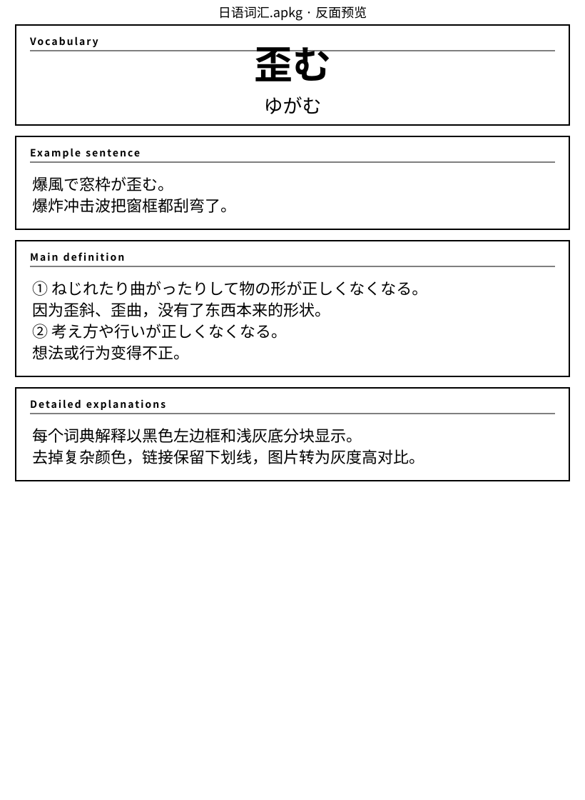

# Anki card previews

These previews show the current `日语词汇.apkg` template layout after the e-ink rewrite.

> Note: previews are kept as SVG text files so the pull request stays text-only and avoids binary-file limitations. Japanese text should display correctly on systems with CJK fonts installed.

## Front

## Back

